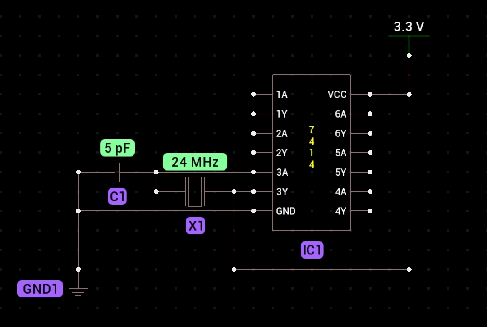
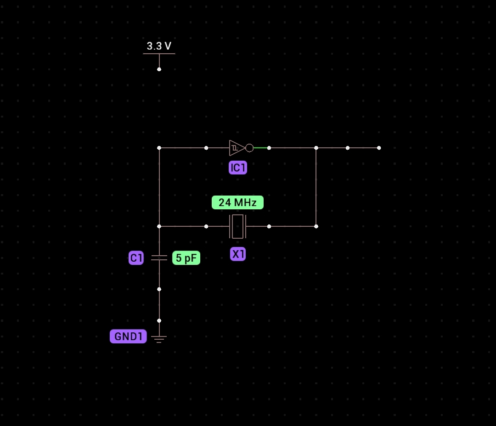

### Up to 50MHz Frequency meter with assembly at PIO in overclocked Raspberry Pi Pico + Oscillator with SN74HC14N six NOT gate IC and 24MHz crystal

**Board:** `Raspberry Pi Pico`

**Firmware:** `RPI-PICO-20240602-v1.23.0.uf2`

**IDE:** `Android Micro REPL App`

**Input PIN:** `GPIO 15`

**Input resistor:** `100 Ohm`

**Oscillator:** `24MHz external square wave generator for testing with SN74HC14N six NOT gate IC and 24MHz crystal`

Oscillator circuit:

=

If you change crystal to different frequency, The oscillator frequency will be changed to new crystal frequency. For example if you change 24MHz crystal with 16MHz crystal, The oscillator frequency will be changed from 24MHz to 16MHz.

Here's a concise list of the families within the 74 series ICs based on their speed and characteristics:

1. Standard TTL (74)
2. Low Power TTL (74L)
3. High-Speed TTL (74H)
4. Schottky TTL (74S)
5. Low Power Schottky TTL (74LS)
6. Advanced Low Power Schottky TTL (74ALS)
7. Advanced Schottky TTL (74AS)
8. Fast TTL (74F)
9. High-Speed CMOS (74HC)
10. Advanced High-Speed CMOS (74HCT)

Each family in the 74 series is designed to meet specific requirements for speed, power consumption, and application suitability, offering a range of options for designing digital logic circuits.
