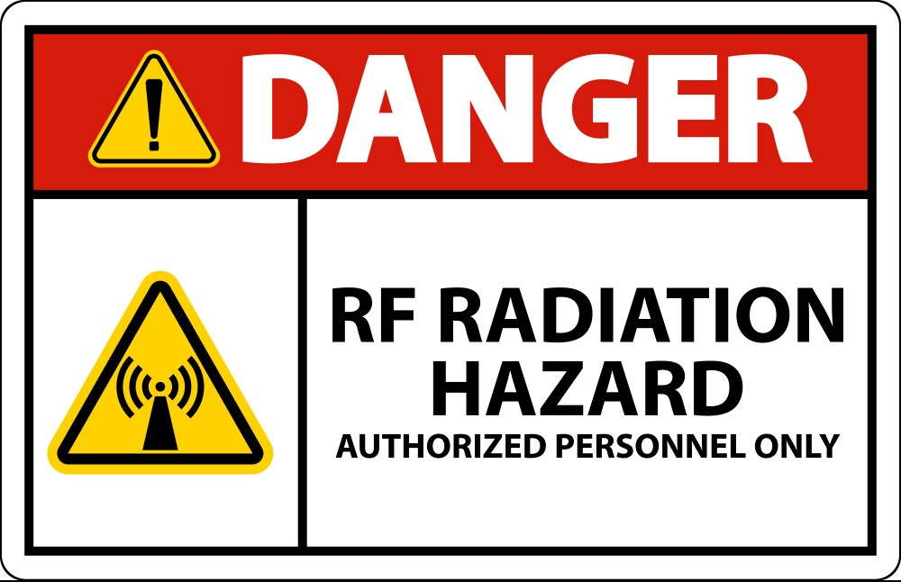

# signal
Signal (Electronics)

Only radio signals, due to their specific characteristics, can be received from very long distances, even if their source is weak. The reasons for this include:

1. **Less Scattering**: Compared to optical signals and higher frequencies, radio signals experience less scattering and absorption. This allows them to travel longer distances.

2. **High Penetrability**: Radio signals can pass through cosmic dust and other obstacles. This feature enables them to be received from sources that are inaccessible at other wavelengths.

3. **Sensitivity of Equipment**: Modern radio telescopes, such as the Giant Metrewave Radio Telescope (GMRT), have very high sensitivity and can receive and amplify very weak signals. These advanced pieces of equipment allow us to access valuable information from very distant sources.

Using these characteristics, scientists can receive and study radio signals that are billions of light-years away, thereby gaining important information about the history and evolution of the universe.

If someone gets lost in a large forest or mountain range, shouting, loudspeakers, and projectors are ineffective due to limited range and visibility. However, a small radio transmitter, even with a single AA battery, can emit signals that travel long distances and penetrate terrain, aiding rescue efforts. For example, the survivors of Uruguay Flight 571 waited for 72 days in the cold weather after a crash in the Andes. A simple radio transmitter could have significantly increased their chances of being found earlier. Thus, a radio signal is a far more reliable tool for attracting rescuers in remote areas.

To working with signals in the electronics, an oscilloscope is needed for analyzing signals. Commercial oscilloscopes on the market are expensive, The Raspberry Pi Pico can be used as a cheap oscilloscope and frequency meter. For this purpose, Use the sample firmwares `scoppy-pico-v8.uf2` or `RPI-PICO-20240602-v1.23.0.uf2` with the Android `Scoppy` App, Windows `Thonny` software, or Android `Micro REPL` App. On Windows, the USB serial COM port driver, specifically the `USB Serial (CDC)` driver, must be installed using `Zadig`.

In action, the Raspberry Pi Pico can measure and scope signals with frequencies in ELF and VLF range due to its low MicroPython loop speed. Its loop speed for measuring the frequency can be dramatically increased to 50MHz by using assembly language and overclocking. Using certain techniques, measuring some signal behaviors can be applied at any frequency, even up to many GHz. In comparison, commercial oscilloscopes can operate up to 500MHz and higher. 

Raspberry pi pico some tasks frequency by means of several methods table:

| Method | Task | Max freq |
|----------|----------|----------|
| Micropython | Oscilloscope & Frequency meter| ~30KHz |
| Assembly | Frequency meter | 50MHz |
| Technique | Frequency meter & Finder | ?GHz |

The frequency ranges:

- Extremely Low Frequency (ELF): 3 Hz to 30 Hz
- Super Low Frequency (SLF): 30 Hz to 300 Hz
- Ultra Low Frequency (ULF): 300 Hz to 3 kHz
- Very Low Frequency (VLF): 3 kHz to 30 kHz
- Low Frequency (LF): 30 kHz to 300 kHz
- Medium Frequency (MF): 300 kHz to 3 MHz
- High Frequency (HF): 3 MHz to 30 MHz
- Very High Frequency (VHF): 30 MHz to 300 MHz
- Ultra High Frequency (UHF): 300 MHz to 3 GHz
- Super High Frequency (SHF): 3 GHz to 30 GHz
- Extremely High Frequency (EHF): 30 GHz to 300 GHz

To measuring the frequency of any sinewave signal, including high-frequency signals up to many GHz, without an oscilloscope, It can be done by measuring the coil inductive reactance in a frequency meter circuit. This task requires understanding the inductive reactance formula and having a multimeter, transistor, inductor, capacitor, diode and etc. The inductive reactance formula is:

$$X_L = 2\pi f L$$

Which:

**XL** is inductive reactance of coil

**f** is frequency of signal 

**L** is inductance of coil or inductor 

So, by understanding inductance and measuring the coil inductive reactance in frequency meter circuit indirectly, the frequency can be calculated using this formula.

For sine wave signals, this formula is directly applicable. The inductive reactance \( X \) represents the opposition that the coil presents to the alternating current (AC) due to its inductance. Since sine waves have a single, well-defined frequency, \( f \), this formula accurately describes the relationship.

For non-sine wave signals, such as square waves, triangle waves, RC waves, RL waves, Pulse waves or other complex waveforms, the situation is more complicated, So, This method is not applicable for measuring the frequency for non-sine wave signals simply. To measuring non-sinewave signals frequency with this method some technics should be applied.

The maximum allowed current for any GPIO pin on the Raspberry Pi Pico, including pin 26 and 27 (which can be used as an ADC input), is 16 mA. However, it's important to note that this current rating applies when the pin is used as a general-purpose I/O. 

When using the pin as an ADC input, you should ensure that the input voltage stays within the acceptable range (0V to 3.3V) and that the current flowing into the pin does not exceed this limit. Exceeding these limits can damage the microcontroller. In practice, the current flowing into an ADC input should be minimal, ideally in the microampere range, as the ADC is designed to measure voltage rather than to sink or source significant current.

# Projects 

**The Electronics in Action**

While it's easy to talk about "electronics," putting it into practice is much harder. "The knack of electronics comes from my years of experience: inductors, crystals, transistors, diodes, and ICs are not highways for electric current. For proper operation, choose the minimum current from them by selecting larger resistors and smaller capacitors. An oscillator should not be expected to amplify electric current simultaneously; it is just an oscillator that deals with low electric current." Here are the types of oscillators:

1. Crystal Oscillator
2. Voltage-Controlled Oscillator (VCO)
3. Phase-Shift Oscillator
4. RC Oscillator
5. LC Oscillator
6. Relaxation Oscillator
7. Negative Resistance Oscillator

Here is the list of oscillator names:

- Pierce Oscillator
- Butler Oscillator
- Gunn Oscillator
- RC Phase Shift Oscillator
- Twin-T Oscillator
- Wien Bridge Oscillator
- Colpitts Oscillator
- Hartley Oscillator
- Clapp Oscillator (Gouriet Oscillator)
- Armstrong Oscillator
- Cross-Coupled LC Oscillator
- Vackář Oscillator
- Seiler Oscillator
- Cathode Follower Oscillator
- Astable Multivibrator
- Hysteretic Oscillator
- Blocking Oscillator
- Relay Oscillator
- Tunnel Diode Oscillator
- Esaki Oscillator
- Ring Oscillator
- Royer Oscillator
- Duffing Oscillator
- Chaotic Oscillator
- Reverse Avalanche Oscillator
- Peltz Oscillator

Here are some successfully tested electronic projects that are practical, applicable, simple, and require only minimal components:

`RaspPiPico1`: Up to 28KHz Frequency meter with micropython at PIO in Raspberry Pi Pico

`RaspPiPico2`: Up to 30MHz Frequency meter with assembly at PIO in Raspberry Pi Pico

`24MHz_Crystal_IC`: Up to 50MHz Frequency meter with assembly at PIO in overclocked Raspberry Pi Pico + Oscillator with SN74HC14N six NOT gate IC and 24MHz crystal 

`16MHz_Crystal_IC`: Up to 50MHz Frequency meter with assembly at PIO in overclocked Raspberry Pi Pico + Oscillator with SN74HC14N six NOT gate IC and 16MHz crystal 

${{\color{red}SECRET}\ Oscillator\ which\ is\ made\ by\ {\color{red}ME}}\ $ 
`SECRET_Osc`: **The SECRET Oscillator with minimal and most simple components ever made in the world by me**

`oscilloscope1`: Up to many KHz Oscilloscope with micropython at ADC in Raspberry Pi Pico

`Finder_100MHz-crystal`: Find the minimum (Vmin) and maximum (Vmax) values of a wave signal at any frequency + 100MHz crystal oscillator 

`Finder2 *`: Find the minimum (Vmin) and maximum (Vmax) values of a wave signal in real-time at any frequency

**Note:** The `*` sign indicates that code in this project is password protected

# Safety 

${{\color{red}DANGER}\}\ $: **Do not work with electronic devices if you are not proficient in electronics, as this can cause damage to the devices and harm to yourself. Additionally, consider the risk of radio frequency radiation hazards from electronic signals.**

Be aware that each safety sign is more than just a sign.
