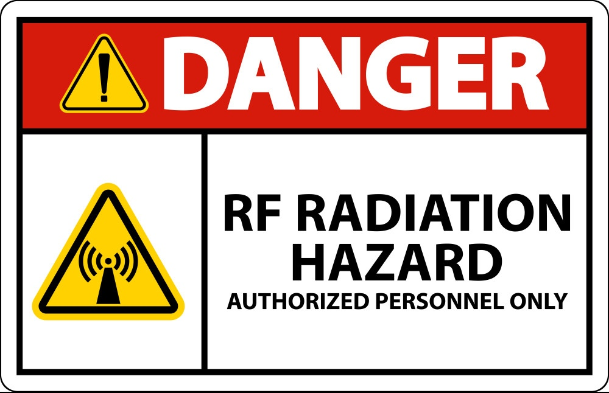

# signal
Signal (Electronics)

Only radio signals, due to their specific characteristics, can be received from very long distances, even if their source is weak. The reasons for this include:

1. **Less Scattering**: Compared to optical signals and higher frequencies, radio signals experience less scattering and absorption. This allows them to travel longer distances.

2. **High Penetrability**: Radio signals can pass through cosmic dust and other obstacles. This feature enables them to be received from sources that are inaccessible at other wavelengths.

3. **Sensitivity of Equipment**: Modern radio telescopes, such as the Giant Metrewave Radio Telescope (GMRT) in India, have very high sensitivity and can receive and amplify very weak signals. These advanced pieces of equipment allow us to access valuable information from very distant sources.

Using these characteristics, scientists can receive and study radio signals that are billions of light-years away, thereby gaining important information about the history and evolution of the universe.

If someone gets lost in a large forest or mountain range, neither shouting, nor yelling through a loudspeaker, nor even turning on a large projector will help them be found. The only thing that can be seen from a thousand kilometers away is a radio signal. It is enough to turn on a small radio transmitter, even if powered by a single AA battery, to be found in the vast forest or mountain range. Maybe it would be better to ask the survivors of Flight 571 about the importance of a simple radio transmitter, who were forced to eat the bodies of their friends to survive for 72 days without food and water in the freezing zero temperatures of the mountains.

Just for a single AA battery and a few electronic components!

To working with signals in the electronics, an oscilloscope is needed for analyzing signals. While many commercial oscilloscopes on the market are expensive, Here is an introduction to a low-cost oscilloscope and some practical projects.

The Raspberry Pi Pico can be used as a low-frequency oscilloscope and frequency meter. For this purpose, Use the sample firmwares `scoppy-pico-v8.uf2` or `RPI-PICO-20240602-v1.23.0.uf2` with the Android `Scoppy` App, Windows `Thonny` software, or Android `Micro REPL` App. On Windows, the USB serial COM port driver, specifically the `USB Serial (CDC)` driver, must be installed using `Zadig`.

In action, the Raspberry Pi Pico can measure and scope signals with frequencies up to many KHz due to its low MicroPython loop speed. Its loop speed for measuring the frequency can be dramatically increased to 50MHz by using assembly language and overclocking. Using certain techniques, measuring some signal behaviors can be applied at any frequency, even up to many GHz. In comparison, commercial oscilloscopes can measure and scope signals up to 500MHz and higher. 

Raspberry pi pico some tasks speed with several methods table:

| Method | Task | Speed |
|----------|----------|----------|
| Micropython | Oscilloscope | 100KHz |
| Assembly | Frequency meter | 50MHz |
| Technic | Frequency meter & Finder | GHz |

To measuring the frequency of any signal, including high-frequency signals up to many GHz, without an oscilloscope, It can be done by measuring the coil impedance in a frequency meter circuit. This task requires understanding the inductive reactance formula and having a multimeter, a transistor, an inductor, a capacitor, a diode and etc. The inductive reactance formula (coil impedance) is:

$$X_L = 2\pi f L$$

Which:

**XL** is impedance of coil

**f** is frequency of signal 

**L** is inductance of coil or inductor 

So, by understanding inductance and measuring the coil impedance in frequency meter circuit indirectly, the frequency can be calculated using this formula.

# Projects 

**The Electronics in Action**

While it's easy to talk about "electronics," putting it into practice is much harder. "The knack of electronics comes from my years of experience: inductors, crystals, transistors, diodes, and ICs are not highways for electric current. For proper operation, choose the minimum current from them by selecting larger resistors and smaller capacitors. An oscillator should not be expected to amplify electric current simultaneously; it is just an oscillator that deals with low electric current." Here are the types of oscillators:

1. Crystal Oscillator
2. Voltage-Controlled Oscillator (VCO)
3. Phase-Shift Oscillator
4. RC Oscillator
5. LC Oscillator
6. Relaxation Oscillator
7. Negative Resistance Oscillator

Here is the list of oscillator names:

- Pierce Oscillator
- Butler Oscillator
- Gunn Oscillator
- RC Phase Shift Oscillator
- Twin-T Oscillator
- Wien Bridge Oscillator
- Colpitts Oscillator
- Hartley Oscillator
- Clapp Oscillator (Gouriet Oscillator)
- Armstrong Oscillator
- Cross-Coupled LC Oscillator
- Vackář Oscillator
- Seiler Oscillator
- Cathode Follower Oscillator
- Astable Multivibrator
- Hysteretic Oscillator
- Blocking Oscillator
- Relay Oscillator
- Tunnel Diode Oscillator
- Esaki Oscillator
- Ring Oscillator
- Royer Oscillator
- Duffing Oscillator
- Chaotic Oscillator
- Reverse Avalanche Oscillator
- Peltz Oscillator

Here are some electronic projects that are practical, applicable, simple, and require only minimal components:

`RaspPiPico1`: Up to 28KHz Frequency meter with micropython at PIO in Raspberry Pi Pico

`RaspPiPico2`: Up to 30MHz Frequency meter with assembly at PIO in Raspberry Pi Pico

`24MHz_Crystal_IC`: Up to 50MHz Frequency meter with assembly at PIO in overclocked Raspberry Pi Pico + Oscillator with SN74HC14N six NOT gate IC and 24MHz crystal 

`16MHz_Crystal_IC`: Up to 50MHz Frequency meter with assembly at PIO in overclocked Raspberry Pi Pico + Oscillator with SN74HC14N six NOT gate IC and 16MHz crystal 

${{\color{red}SECRET}\ Oscillator\ which\ is\ made\ by\ {\color{red}ME}}\ $ 
`SECRET_Osc`: **The SECRET Oscillator with minimal and most simple components ever made in the world by me**

`oscilloscope1`: Up to many KHz Oscilloscope with micropython at ADC in Raspberry Pi Pico

`Finder_100MHz-crystal`: Find the minimum (Vmin) and maximum (Vmax) values of a wave signal at any frequency + 100MHz crystal oscillator 

# Safety 

${{\color{red}DANGER}\}\ $: **Do not work with electronic devices if you are not proficient in electronics, as this can cause damage to the devices and harm to yourself. Additionally, consider the risk of radio frequency radiation hazards from electronic signals.**

Be aware that each safety sign is more than just a sign.
