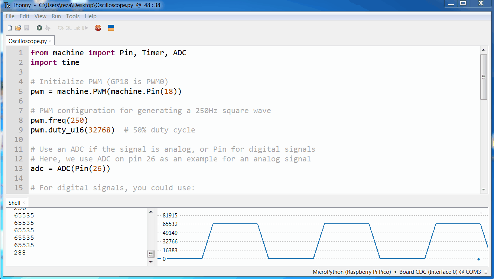

**Board:** `Raspberry Pi Pico`

**Firmware:** `RPI-PICO-20240602-v1.23.0.uf2`

**IDE:** `Thonny 4.1.4 Windows software`

**Input PIN:** `ADC 26`

**Input resistor:** `1K Ohm`

**Oscillator:** `250Hz internal PWM square wave generator at PIN 18 for testing`

**Note:** Do not use PWM wave generator to generating any frequency for testing, Because real frequency of PWM wave generator is sometimes different than pulse width modulation frequency.
